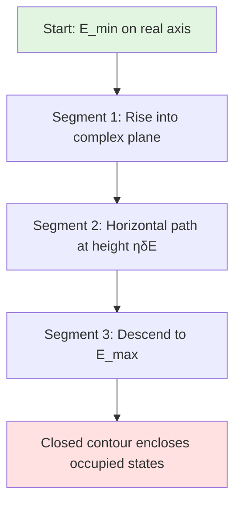
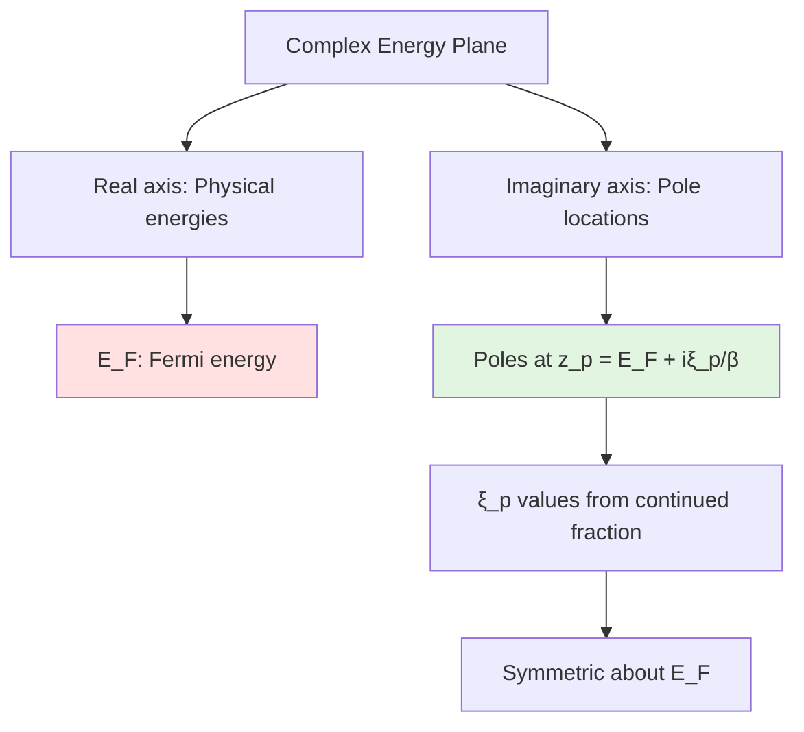
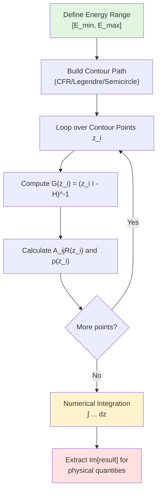

# Green's Function Method for Density and Exchange Calculations

## Table of Contents
1. [Overview](#overview)
2. [Theoretical Background](#theoretical-background)
3. [Density Matrix Calculation](#density-matrix-calculation)
4. [Magnetic Moments](#magnetic-moments)
5. [Exchange Parameters](#exchange-parameters)
6. [Integration Methods](#integration-methods)
7. [Implementation Details](#implementation-details)
8. [Numerical Considerations](#numerical-considerations)

---

## Overview

This document describes the Green's function method implemented in TB2J for calculating electronic density matrices, magnetic moments, and magnetic exchange parameters. The method provides an alternative to direct eigenvector-based calculations and is particularly useful for systems where contour integration offers computational or theoretical advantages.

### Key Features
- **Two density calculation methods**: Direct eigenvector and Green's function contour integration
- **Multiple integration contours**: CFR (Continued Fraction Representation), Legendre, and Semicircle
- **Spin-resolved calculations**: Support for collinear and non-collinear magnetism
- **Perturbation theory**: Exchange parameters via second-order perturbation theory

---

## Theoretical Background

### Green's Function Formalism

The single-particle Green's function in the tight-binding representation is defined as:

$$
G_{ij}(z) = \langle i | (z\mathbb{I} - H)^{-1} | j \rangle
$$

where:
- $z$ is a complex energy
- $H$ is the Hamiltonian matrix
- $|i\rangle, |j\rangle$ are orbital basis states
- $\mathbb{I}$ is the identity matrix

For a system with eigenvalues $\{E_n\}$ and eigenvectors $\{|\psi_n\rangle\}$, the spectral representation is:

$$
G(z) = \sum_n \frac{|\psi_n\rangle \langle \psi_n|}{z - E_n}
$$

### Relationship to Density Matrix

The key connection between Green's functions and the density matrix comes from the **Cauchy residue theorem**. For a contour $\mathcal{C}$ enclosing all occupied states below the Fermi energy $E_F$:

$$
\rho = -\frac{1}{2\pi i} \oint_{\mathcal{C}} G(z) \, dz
$$

Evaluating the contour integral using residues:

$$
\rho_{ij} = \sum_{E_n < E_F} \langle i | \psi_n \rangle \langle \psi_n | j \rangle = \sum_{E_n < E_F} \psi_n^i (\psi_n^j)^*
$$

This is exactly the **occupied-states density matrix**.

### Complex Plane Integration

In practice, we deform the contour to avoid poles on the real axis:



The imaginary part of the contour integral yields the physical density:

$$
\rho = -\frac{1}{\pi} \int_{\text{contour}} \text{Im}[G(z)] \, dz
$$

---

## Density Matrix Calculation

### Two Approaches

TB2J implements two methods for density matrix calculation:

#### 1. Eigenvector Method (Direct)
$$
\rho = \sum_{\mathbf{k}} w_{\mathbf{k}} \sum_n f(E_{n\mathbf{k}}) |\psi_{n\mathbf{k}}\rangle \langle \psi_{n\mathbf{k}}|
$$

where:
- $w_{\mathbf{k}}$ are k-point weights
- $f(E)$ is the Fermi-Dirac occupation function
- Yields a **real-valued** density matrix

**Advantages**: Fast, numerically stable, standard approach

#### 2. Green's Function Method (Contour Integration)
$$
\rho = -\frac{1}{\pi} \sum_{\mathbf{k}} w_{\mathbf{k}} \int_{\mathcal{C}} \text{Im}[G_{\mathbf{k}}(z)] \, dz
$$

where:
- $G_{\mathbf{k}}(z) = (z\mathbb{I} - H_{\mathbf{k}})^{-1}$
- Integration performed along a complex contour $\mathcal{C}$
- Yields a **complex-valued** result: $\rho = \rho_{\text{real}} + i \rho_{\text{imag}}$

**The physical density is in the imaginary part**: $\rho_{\text{physical}} = \text{Im}[\rho_{\text{integrated}}]$

**Advantages**: Natural for finite-temperature calculations, useful for perturbation theory

### Spin-Resolved Density

For collinear magnetism with separated spin channels:

$$
\rho = \begin{pmatrix}
\rho_{\uparrow\uparrow} & 0 \\
0 & \rho_{\downarrow\downarrow}
\end{pmatrix}
$$

For the merged spinor representation:

$$
\rho = \begin{pmatrix}
\rho_{\uparrow\uparrow}^{1} & \rho_{\uparrow\downarrow}^{1} & \cdots \\
\rho_{\downarrow\uparrow}^{1} & \rho_{\downarrow\downarrow}^{1} & \cdots \\
\vdots & \vdots & \ddots
\end{pmatrix}
$$

where the basis ordering can be either:
- **Separated**: $[\uparrow_1, \uparrow_2, \ldots, \downarrow_1, \downarrow_2, \ldots]$
- **Interleaved**: $[\uparrow_1, \downarrow_1, \uparrow_2, \downarrow_2, \ldots]$

---

## Magnetic Moments

### Pauli Decomposition

For spinor systems, the density matrix is decomposed into Pauli components:

$$
\rho = \rho_0 \sigma_0 + \rho_x \sigma_x + \rho_y \sigma_y + \rho_z \sigma_z
$$

where $\sigma_0 = \mathbb{I}$ and $\{\sigma_x, \sigma_y, \sigma_z\}$ are Pauli matrices.

The coefficients are extracted via:

$$
\begin{aligned}
\rho_0 &= \frac{1}{2}\text{Tr}[\rho \sigma_0] = \frac{1}{2}(\rho_{\uparrow\uparrow} + \rho_{\downarrow\downarrow}) \\
\rho_x &= \frac{1}{2}\text{Tr}[\rho \sigma_x] = \frac{1}{2}(\rho_{\uparrow\downarrow} + \rho_{\downarrow\uparrow}) \\
\rho_y &= \frac{1}{2}\text{Tr}[\rho \sigma_y] = \frac{i}{2}(\rho_{\downarrow\uparrow} - \rho_{\uparrow\downarrow}) \\
\rho_z &= \frac{1}{2}\text{Tr}[\rho \sigma_z] = \frac{1}{2}(\rho_{\uparrow\uparrow} - \rho_{\downarrow\downarrow})
\end{aligned}
$$

### Charge and Magnetization

For each atom $\alpha$, projecting onto atomic orbitals:

$$
\begin{aligned}
Q_{\alpha} &= 2\text{Tr}[\rho_{\alpha,0}] = \text{Tr}[\rho_{\alpha,\uparrow\uparrow}] + \text{Tr}[\rho_{\alpha,\downarrow\downarrow}] \\
M_{\alpha}^x &= 2\text{Tr}[\rho_{\alpha,x}] \\
M_{\alpha}^y &= 2\text{Tr}[\rho_{\alpha,y}] \\
M_{\alpha}^z &= 2\text{Tr}[\rho_{\alpha,z}] = \text{Tr}[\rho_{\alpha,\uparrow\uparrow}] - \text{Tr}[\rho_{\alpha,\downarrow\downarrow}]
\end{aligned}
$$

The factor of 2 accounts for the $1/2$ in the Pauli decomposition.

### Real vs Imaginary Parts

**Critical distinction**:

| Method | Density Matrix | Use for Pauli Traces |
|--------|---------------|---------------------|
| Eigenvector | Real-valued | $\rho_{\alpha,\mu} = \text{Re}[\text{Tr}(\rho \sigma_\mu)]$ |
| Green's Function | Complex-valued | $\rho_{\alpha,\mu} = \text{Im}[\text{Tr}(\rho \sigma_\mu)]$ |

This difference arises because:
- Eigenvector method: $\rho \in \mathbb{R}$, physical quantities are real
- Contour integration: $\rho = \rho_{\text{R}} + i\rho_{\text{I}}$, physical density is $\rho_{\text{I}}$

---

## Exchange Parameters

### Perturbation Theory Framework

The magnetic exchange interaction between atoms $i$ and $j$ is calculated using second-order perturbation theory. The exchange Hamiltonian:

$$
\mathcal{H}_{\text{ex}} = -\sum_{i,j,\mathbf{R}} \mathbf{S}_i \cdot \mathbf{J}_{ij}(\mathbf{R}) \cdot \mathbf{S}_j(\mathbf{R})
$$

The isotropic exchange $J_{ij}$ is extracted from the exchange tensor $\mathbf{J}_{ij}$.

### Green's Function Expression

The key quantity is the A-matrix, computed using intersite Green's functions with Pauli decomposition:

$$
A_{ij}^{\mu\nu}(\mathbf{R}) = -\frac{1}{\pi} \oint_{\mathcal{C}} \text{Tr}\left[ P_i G_{ij}^{\mu}(z,\mathbf{R}) P_j G_{ji}^{\nu}(z,-\mathbf{R}) \right] dz
$$

where:
- $P_i, P_j$ are the exchange splitting matrices on atoms $i$ and $j$
- $G_{ij}^{\mu}(z,\mathbf{R})$ is the $\mu$-th Pauli component of the intersite Green's function from atom $i$ to atom $j$ at lattice vector $\mathbf{R}$
- $G_{ji}^{\nu}(z,-\mathbf{R})$ is the $\nu$-th Pauli component of the intersite Green's function from atom $j$ to atom $i$ at lattice vector $-\mathbf{R}$
- $\mu, \nu \in \{0, x, y, z\}$ index the Pauli matrix components

The isotropic exchange parameter is:

$$
J_{ij}(\mathbf{R}) = \frac{1}{4}\text{Im}\left[ A_{ij}^{00} - A_{ij}^{xx} - A_{ij}^{yy} - A_{ij}^{zz} \right]
$$

### Exchange Splitting Matrix $P_i$

For collinear systems, $P_i$ is derived from the difference between spin-up and spin-down Hamiltonians:

$$
P_i = \frac{1}{2}(H_i^{\uparrow\uparrow} - H_i^{\downarrow\downarrow})
$$

This represents the local exchange splitting on atom $i$.

---

## Integration Methods

### Contour Path Selection

TB2J implements three integration contour types:

#### 1. CFR (Continued Fraction Representation)

The Continued Fraction Representation (CFR) method, developed by Ozaki (2007), provides an elegant way to represent the Fermi-Dirac function as a sum of simple poles in the complex plane. This enables highly efficient contour integration without requiring explicit real-axis quadrature.

##### Mathematical Foundation

The Fermi-Dirac occupation function is:

$$
f(E) = \frac{1}{1 + \exp(\beta(E-E_F))}
$$

where $\beta = 1/(k_B T)$ is the inverse temperature. Ozaki showed that this can be expressed as a continued fraction:

$$
f(E) = \frac{1}{2} + \frac{1}{\pi} \sum_{p=1}^{N_p} \frac{\alpha_p}{\beta(E - E_F) + i\xi_p}
$$

where:
- $\alpha_p$ are real-valued residues (weights)
- $\xi_p$ are imaginary parts of the poles
- $N_p$ is the number of poles (typically 10-20 for good accuracy)

The poles are located at complex energies:

$$
z_p = E_F + \frac{i\xi_p}{\beta} = E_F + ik_B T \xi_p
$$

All poles lie on a line parallel to the imaginary axis, passing through the Fermi energy $E_F$.

##### Pole Structure in the Complex Plane



The poles are distributed symmetrically in the complex plane:
- Positive poles: $z_p = E_F + i|k_B T \xi_p|$ (upper half-plane)
- Negative poles: $z_{-p} = E_F - i|k_B T \xi_p|$ (lower half-plane)

##### Density Matrix Calculation

Using the CFR expansion, the density matrix becomes:

$$
\rho = \sum_{\mathbf{k}} w_{\mathbf{k}} \left[ \frac{1}{2}\mathbb{I} + \frac{1}{\pi} \sum_{p=1}^{N_p} \alpha_p \text{Re}\left[ G_{\mathbf{k}}(z_p) \right] \right]
$$

where:
- The $\frac{1}{2}\mathbb{I}$ term accounts for the zero-temperature contribution at $E_F$
- Only the **real part** of the Green's function at pole positions contributes
- No explicit energy integration is needed—only evaluations at discrete pole positions

In practice, for TB2J calculations, we use the imaginary part of the integrated result (see Density Matrix Calculation section).

##### Computational Advantages

1. **Efficiency**: Instead of integrating over $O(100)$ energy points, only $N_p \approx 10-20$ pole evaluations are needed
2. **Temperature dependence**: Natural finite-temperature formulation via $\beta = 1/(k_B T)$
3. **Accuracy**: Exponential convergence with number of poles $N_p$
4. **Stability**: Poles are away from the real axis, avoiding numerical issues near band edges

##### Implementation in TB2J

The CFR method is implemented in the `Contour` class:

```python
# In exchange.py, line ~100
T_kelvin = self.smearing / ase.units.kB  # Convert smearing to temperature
self.contour = CFR(nz=self.nz, T=T_kelvin)
```

The `CFR` class:
- Computes pole positions $\{z_p\}$ and residues $\{\alpha_p\}$ using Ozaki's algorithm
- Stores them as the integration contour "path"
- Provides integration weights for accumulating Green's function contributions

##### Practical Considerations

**Temperature Selection**: The temperature $T$ (or equivalently, smearing width) should be chosen such that:
- $k_B T \ll$ band gap (if insulating)
- $k_B T \sim 0.01-0.1$ eV for metals (typical DFT smearing values)
- Higher $T$ requires fewer poles but reduces accuracy for sharp features

**Number of Poles**: 
- Default: `nz = 50-100` (overkill for most cases)
- Sufficient: `nz = 10-20` for typical DFT calculations
- More poles needed for: very low temperature, sharp DOS features

**Convergence Test**:
```python
# Check convergence with respect to nz
for nz in [10, 20, 50, 100]:
    contour = CFR(nz=nz, T=T_kelvin)
    # Compare resulting density matrices or exchange parameters
```

##### Comparison with Real-Axis Integration

| Aspect | CFR Method | Real-Axis (Legendre/Trapezoid) |
|--------|------------|--------------------------------|
| Energy points | 10-20 pole evaluations | 50-200 quadrature points |
| Temperature | Natural finite-T formulation | Requires smearing function |
| Accuracy | Exponential in $N_p$ | Polynomial in grid density |
| Stability | Poles off real axis | Can have issues near DOS peaks |
| Speed | **Faster** (fewer evaluations) | Slower (more evaluations) |

**Reference**: Ozaki, T. "Continued fraction representation of the Fermi-Dirac function for large-scale electronic structure calculations." *Phys. Rev. B* **75**, 035123 (2007). DOI: [10.1103/PhysRevB.75.035123](https://doi.org/10.1103/PhysRevB.75.035123)

**Additional Reading**: The original paper provides explicit formulas for computing $\{\xi_p, \alpha_p\}$ and discusses convergence properties in detail.

#### 2. Legendre Integration
Uses Gauss-Legendre quadrature points on the transformed interval:

$$
\int_{E_{\min}}^{E_{\max}} G(E + i\eta) \, dE \approx \sum_{i=1}^{N} w_i G(E_i + i\eta)
$$

where $\{E_i, w_i\}$ are Legendre quadrature points and weights.

**Advantages**: Spectral accuracy, efficient for smooth integrands

#### 3. Semicircle
Contour along a semicircular arc in the complex plane:

$$
z(\theta) = \frac{E_{\max} + E_{\min}}{2} + \frac{E_{\max} - E_{\min}}{2} e^{i\theta}, \quad \theta \in [0, \pi]
$$

**Advantages**: Symmetric, avoids real axis entirely

### Integration Process



### Numerical Integration Weights

For discrete contour points $\{z_1, z_2, \ldots, z_N\}$ with weights $\{w_1, w_2, \ldots, w_N\}$:

$$
\int_{\mathcal{C}} f(z) \, dz \approx \sum_{i=1}^{N} w_i f(z_i)
$$

The weights depend on the integration method:
- **Simpson's rule**: $w_i = h/3 \times [1, 4, 2, 4, 2, \ldots, 4, 1]$
- **Gauss-Legendre**: $w_i$ are Gaussian quadrature weights
- **Trapezoidal**: $w_i = h \times [0.5, 1, 1, \ldots, 1, 0.5]$

---

## Implementation Details

### Code Structure

The implementation is centered in `ExchangePert2` class which inherits from `ExchangeNCL`:

```python
class ExchangePert2(ExchangeNCL):
    def set_epw(self, density_method='eigenvector'):
        """
        density_method: str
            - 'eigenvector': Direct eigenvalue summation (default)
            - 'greens_function': Contour integration
        """
```

### Density Calculation Workflow

1. **Initialize Green's function object** (`TBGreen`)
2. **Choose integration method** (CFR/Legendre/Semicircle)
3. **Build contour path** with energy range $[E_{\min}, E_{\max}]$
4. **Loop over contour points**:
   - Compute $G(\mathbf{k}, z_i) = (z_i \mathbb{I} - H_{\mathbf{k}})^{-1}$
   - Accumulate k-point weighted contributions
5. **Perform numerical integration** with contour weights
6. **Extract physical quantities**:
   - Eigenvector method: Use `.real`
   - Green's function method: Use `.imag`

### Basis Format Handling

TB2J automatically detects the spin basis format:

```python
# Detect basis format
orbs = self.iorb(magnetic_atom_index)
if orbs[-1] - orbs[0] != len(orbs) - 1:
    basis_is_separated = True  # [↑₁,↑₂,...,↓₁,↓₂,...]
else:
    basis_is_separated = False  # [↑₁,↓₁,↑₂,↓₂,...]
```

For separated basis, convert to interleaved before Pauli decomposition:

```python
if basis_is_separated:
    ni = tmp.shape[0] // 2
    tmp_interleaved[::2, ::2] = tmp[:ni, :ni]    # uu
    tmp_interleaved[1::2, 1::2] = tmp[ni:, ni:]  # dd
    tmp_interleaved[::2, 1::2] = tmp[:ni, ni:]   # ud
    tmp_interleaved[1::2, ::2] = tmp[ni:, :ni]   # du
```

### Exchange Parameter Calculation

The A-matrix for exchange is computed similarly using intersite Green's functions:

$$
A_{ij}^{\mu\nu}(\mathbf{R}) = \oint_{\mathcal{C}} \text{Tr}\left[ P_i G_{ij}^{\mu}(z,\mathbf{R}) P_j G_{ji}^{\nu}(z,-\mathbf{R}) \right] dz
$$

This is integrated along the same contour, yielding a complex result. The exchange parameter is:

$$
J_{ij}(\mathbf{R}) = \text{Im}\left[\frac{1}{4}(A^{00} - A^{xx} - A^{yy} - A^{zz})\right]
$$

---

## Exchange Derivative Optimization

For finding the derivative of exchange parameters with respect to atomic displacement ($dJ/dx$), TB2J uses a k-space formulation for efficiency and robustness.

### The Problem
The derivative of the Green's function, $dG/dx$, is related to the derivative of the Hamiltonian $dH/dx$ (or electron-phonon coupling $dV$). In real space, this convolution:
$$
dG(R) = \sum_{r, r'} G(r) dV(r-r') G(R-r')
$$
scales poorly ($O(N_R^2)$) and is sensitive to the range of R-vectors included in the summation.

### The Solution (Vertex Function)
Transforming to reciprocal space, the convolution becomes a product:
$$
dG(k) = \Lambda(k) G(k)
$$
where $\Lambda(k)$ is the "Vertex Function":
$$
\Lambda(k) = \sum_{Rq, Rk} G(R_u - R_q) dV_{Rq, Rk} e^{ik \cdot (R_u - R_q + R_k)}
$$
This allows calculating $dG(k)$ for all k-points via vectorized matrix operations, followed by a Fast Fourier Transform to obtain $dG(R)$. This method is:
1.  **Faster**: Scales as $O(N_k)$ instead of $O(N_R^2)$.
2.  **Exact**: Includes all relevant short-range contributions naturally.
3.  **Robust**: Avoids missing R-vector issues common in real-space truncations.


## Numerical Considerations

### Convergence Parameters

| Parameter | Typical Value | Effect |
|-----------|---------------|--------|
| `nz` | 50-200 | Number of contour points |
| `emin` | $E_F - 15$ eV | Lower integration bound |
| `emax` | $E_F$ | Upper integration bound (Fermi energy) |
| `η` (imaginary shift) | 0.01-0.1 eV | Pole broadening |
| `kmesh` | $[5,5,5]$ - $[20,20,20]$ | k-point sampling |

### Accuracy and Efficiency

**Eigenvector method**:
- ✓ Faster (no contour integration loop)
- ✓ Numerically stable
- ✓ Standard approach
- ✗ Requires full diagonalization

**Green's function method**:
- ✓ Natural for perturbation theory
- ✓ Can handle complex energy dependence
- ✓ Useful for spectral functions
- ✗ Slower (contour integration loop)
- ✗ Requires careful contour choice

### Validation

Both methods should yield identical results:

```python
# Test convergence
rho_eig = self.G.get_density_matrix()
rho_gf = self.contour.integrate_values(rhoRs)

print(f"Tr(ρ_eigenvector) = {np.trace(rho_eig):.6f}")
print(f"Tr(ρ_GF) = {np.trace(rho_gf).imag:.6f}")  # Use .imag!
# Should match within numerical precision
```

### Common Pitfalls

1. **Forgetting `.imag` for GF method**: The physical density is in the imaginary part
2. **Wrong spin basis ordering**: Always detect and convert to interleaved for Pauli decomposition
3. **Insufficient contour points**: Increase `nz` if results don't converge
4. **Energy range too narrow**: Include all relevant states in $[E_{\min}, E_{\max}]$
5. **K-point sampling**: Exchange parameters require well-converged k-meshes

---

## References

1. Liechtenstein, A. I., et al. "Exchange interactions and spin-wave stiffness in ferromagnetic metals." *J. Phys. F: Met. Phys.* **14**, L125 (1984).
2. Ozaki, T. "Continued fraction representation of the Fermi-Dirac function for large-scale electronic structure calculations." *Phys. Rev. B* **75**, 035123 (2007). DOI: [10.1103/PhysRevB.75.035123](https://doi.org/10.1103/PhysRevB.75.035123)
3. He, X., et al. "TB2J: A python package for computing magnetic interaction parameters." *Comp. Phys. Comm.* **264**, 107938 (2021).
4. Fetter, A. L., & Walecka, J. D. *Quantum Theory of Many-Particle Systems*. Dover Publications (2003).
5. Economou, E. N. *Green's Functions in Quantum Physics*. Springer (2006).

---

## Appendix: Mathematical Derivations

### Derivation of Density from Green's Function

Starting from the spectral representation:

$$
G(z) = \sum_n \frac{|\psi_n\rangle \langle \psi_n|}{z - E_n}
$$

The contour integral around occupied states:

$$
\begin{aligned}
\oint_{\mathcal{C}} G(z) \, dz &= \oint_{\mathcal{C}} \sum_n \frac{|\psi_n\rangle \langle \psi_n|}{z - E_n} \, dz \\
&= \sum_n |\psi_n\rangle \langle \psi_n| \oint_{\mathcal{C}} \frac{dz}{z - E_n}
\end{aligned}
$$

By Cauchy's residue theorem:

$$
\oint_{\mathcal{C}} \frac{dz}{z - E_n} = \begin{cases}
2\pi i & \text{if } E_n < E_F \text{ (enclosed)} \\
0 & \text{if } E_n > E_F \text{ (not enclosed)}
\end{cases}
$$

Therefore:

$$
\oint_{\mathcal{C}} G(z) \, dz = 2\pi i \sum_{E_n < E_F} |\psi_n\rangle \langle \psi_n| = 2\pi i \, \rho
$$

Thus:

$$
\rho = -\frac{1}{2\pi i} \oint_{\mathcal{C}} G(z) \, dz
$$

Taking the contour integral along a path slightly above the real axis with $z = E + i\eta$, and using $G(E + i\eta) = G_R(E) + i G_I(E)$:

$$
\rho = -\frac{1}{\pi} \int_{-\infty}^{E_F} \text{Im}[G(E)] \, dE
$$

This is the **imaginary part** of the integrated Green's function that yields the density matrix.
