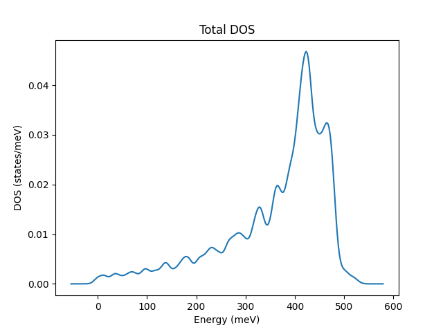

Magnon Band Structure
==================

TB2J provides multiple ways to calculate and visualize magnon band structures from the exchange parameters.

New Interface (v0.9.9.9+)
------------------------

.. include:: magnon_bands.md
   :parser: myst_parser.sphinx_

Legacy Interface
--------------

There are also older scripts within the TB2J package for magnon calculations:

TB2J_magnon.py
~~~~~~~~~~~~~

This script can be used to plot magnon band structure from the Multibinit XML format:

::

   TB2J_magnon.py --help

   usage: TB2J_magnon.py [-h] [--fname FNAME] [--qpath QPATH]  [--figfname FIGFNAME] [--show]

   TB2J_magnon: Plot magnon band structure from the TB2J magnetic interaction parameters

   optional arguments:
     -h, --help     show this help message and exit
     --fname FNAME  exchange xml file name. default: exchange.xml
     --qpath QPATH  The names of special q-points. If not given, the path will be automatically chosen.
     --figfname FIGFNAME  The file name of the figure.
     --show         whether to show magnon band structure.

The input file (--fname) is by default exchange.xml, which can be found in the TB2J_results/Multibinit directory.

Example usage with BCC Fe:

::

   TB2J_magnon.py --qpath GNPGHN --figfname magnon.png --show

.. figure:: magnon_band.assets/exchange_magnon-1593690872101.png
   :alt: exchange_magnon

   exchange_magnon

From version v0.7.5, the information for plotting the band structure is written into a json file (magnon_band.json), along with a script for parsing and plotting (plot_magnon_from_json_file.py).

TB2J_magnon_dos.py
~~~~~~~~~~~~~~~~

From version v0.7.7, there is a script to plot the magnon density of states:

::
    
    TB2J_magnon_dos.py --help
    usage: TB2J_magnon_dos.py [-h] [-p PATH] [-n NPOINTS] [-w WINDOW WINDOW] [-k KMESH KMESH KMESH]
                              [-s SMEARING_WIDTH] [-g] [-Jq] [--show] [-f FIG_FILENAME] [-t TXT_FILENAME]

Example usage:

::

    TB2J_magnon_dos.py --show -s 10 -k 25 25 25 -f magnon_dos.png --show

   magnon_dos

The energies and DOS are saved to a text file with two columns (energies and DOS), which can be used for custom plotting.
