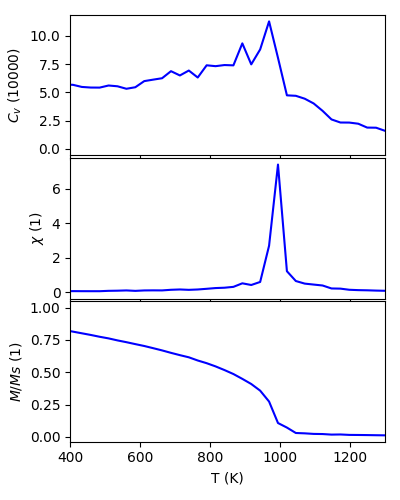

Application: Spin Dynamics
=====================================

The output of TB2J can be directly readed by several atomistic spin
dynamics and Monte Carlo code. Currently TB2J can provide output for
MULTIBINIT and Vampire. 

Interface with Multibinit
------------------------------------------
Here we show how to use MULTIBINIT, a
second principles code which can do spin dynamics. It is a part of the
`ABINIT <ABINIT>`_ package since version 9.0. The tutorial of the spin dynamics can be found
on `MULTIBINIT tutorial page <MULTIBINIT>`_.

.. _ABINIT: https://www.abinit.org
.. _MULTIBINIT: https://docs.abinit.org/tutorial/spin_model

Here we briefly describe how to run spin dynamics with MULTIBINIT from the TB2J outputs to with an example of BiFeO3. The example files can be found from the examples/Siesta/BiFeO3 directory.

In the TB2J\_results/Mutlbinit directory, there are three files: exchange.xml, mb.in, and mb.files file. The exchange.xml file contains the Heisenberg parameters, the mb.in file is an input to the MULTIBINIT code, in which the parameters for the spin dynamics are given::

  prt_model = 0

  #--------------------------------------------------------------
  #Monte carlo / molecular dynamics
  #--------------------------------------------------------------
  dynamics =  0    ! disable molecular dynamics

  ncell =   28 28 28  ! size of supercell.
  #-------------------------------------------------------------
  #Spin dynamics
  #------------------------------------------------------------
  spin_dynamics=1  ! enable spin dynamics
  spin_mag_field= 0.0 0.0 0.0   ! external magnetic field
  spin_ntime_pre = 10000          ! warming up steps.
  spin_ntime =10000             ! number of steps.
  spin_nctime=100               ! number of time steps between two nc file write
  spin_dt=1e-15 s               ! time step.
  spin_init_state = 1           ! FM initial state. May cause some trouble

  spin_temperature=0.0

  spin_var_temperature=1        ! switch on variable temperature calculation
  spin_temperature_start=0      ! starting point of temperature
  spin_temperature_end=1300      ! ending point of temperature.
  spin_temperature_nstep= 52     ! number of temperature steps.

  spin_sia_add = 1              ! add a single ion anistropy (SIA) term?
  spin_sia_k1amp = 1e-6         ! amplitude of SIA (in Ha), how large should be used?
  spin_sia_k1dir = 0.0 0.0 1.0  ! direction of SIA

  spin_calc_thermo_obs = 1      ! calculate thermodynamics related observables

We can modify the default supercell size (ncell) and the temperature range to do spin dynamics in a temperature from 0K to 1300K in order to calculate the Neel temperature. We can run ::

  mpirun -np 4 multibinit --F03 < mb.files

to run the spin dynamics. A mb.out.varT file is then generated, which has the volume heat capacit :math:`C_v`, magnetic susceptibility :math:`\\chi`, and normalized total magnetic moment. They can be plotted as function of temperature as below, from which we can find the Neel temperature.

Interface with Vampire
--------------------------------------
Warning: there might be compatibility issues in the TB2J-Vampire interface for some versions, please contact the developpers if you encounter some of them. 

A few notes about the Vampire input format:

There are 6 exchange interaction format in Vampire. 

* isotropic

* vectorial

* tensorial

* normalised-isotropic

* normalised-vectorial

* normalised-tensorial

Since version 0.7.1, the TB2J-Vampire output take the "tensorial" format, in which the exchange values are 2 times that in the convention of TB2J exchange.out file. This convention is automatically applied in the TB2J-Vampire interface.
The anisotropic exchange and DMI are not written before version 0.7.2. They are included since then. 
